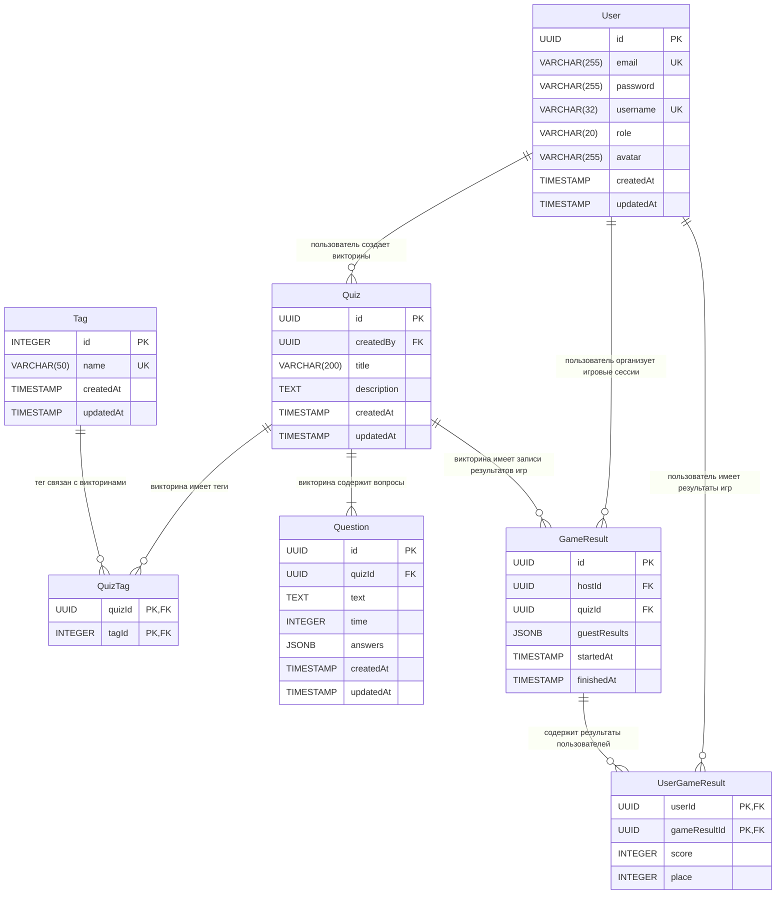

# QuizLink – Платформа для совместного проведения викторин в реальном времени

## Стек технологий

> Стек может пополняться по ходу разработки

| Слой               | Технологии                                                                                              |
| ------------------ | ------------------------------------------------------------------------------------------------------- |
| **Frontend**       | React, TypeScript, Tailwind CSS, React Router, TanStack Query, Zustand, React Hook Form, Zod, Socket.IO |
| **Backend**        | Node.js, Fastify, Prisma ORM, Socket.IO, redis                                                          |
| **Database**       | PostgreSQL, Redis                                                                                       |
| **Инфраструктура** | Docker                                                                                                  |

## Описание проекта

### Идея

Прохождение традиционных викторин часто ощущается скучным и одиноким: игроки проходят викторины в разное время, не чувствуют дух живого соперничества. Участие в викторине, требующей физического присутствия, может быть проблематичным для людей, находящихся в разных местах, необходимо обеспечивать синхронное начало, отслеживание прогресса и подсчет результатов.

QuizLink позволяет людям совместно участвовать в викторинах из любой точки мира, достаточно поделиться ссылкой с другим человеком. Одновременный старт для всех участников, синхронизация времени и автоматический подсчет баллов. Также предоставляется удобный интерфейс для создания и управления викторинами.

### Целевая аудитория

- **Любители викторин и игр** – люди, объединенные общими увлечениями, которые хотят проверить свои знания и посоревноваться.
- **Организаторы мероприятий** – развлечение гостей.

## Пользовательские сценарии (User Stories)

```
Как игрок, я хочу найти викторины по интересующим меня темам,
  чтобы весело провести время.

Как игрок, я хочу подключиться к викторине без регистрации,
  чтобы не терять время.

Как игрок, я хочу видеть таблицу лидеров текущей игры,
  чтобы понимать свой уровень мастерства.

Как организатор, я хочу возможность ставить викторину на паузу,
  чтобы сделать перерыв для людей.

Как организатор, я хочу выводить QR-код для входа в игру на экран,
  чтобы люди могли быстро подключиться.

Как организатор, я хочу защитить паролем викторину,
  чтобы ограничить к ней доступ.
```

## Уникальные фичи

1. **Совместная игра** – совместное прохождение викторин в реальном времени.
2. **Редактор викторин** – каждый пользователь может создать свою викторину.
3. **Умный поиск** – поиск викторин по названию, описанию или теме.

## Макет сайта

[Схематичный макет сайта в Figma](https://www.figma.com/design/GZfE1nIkq87YA46Db9Q2pP/QuizLink)

## Список сущностей

| Сущность      | Ключевые поля                                           | Хранилище  |
| ------------- | ------------------------------------------------------- | ---------- |
| `User`        | id, username, email, password, role, avatar             | PostgreSQL |
| `Quiz`        | id, createdBy, title, description                       | PostgreSQL |
| `Question`    | id, quizId, text, time, answers                         | PostgreSQL |
| `Tag`         | id, name                                                | PostgreSQL |
| `GameResult`  | id, hostId, quizId, results, startedAt, finishedAt      | PostgreSQL |
| `GameSession` | id, quizId, status, currentQuestionId, users, questions | Redis      |

## ER-диаграмма



### Описание связей

| Связь                       | Тип | Описание                                                                                                                            |
| --------------------------- | --- | ----------------------------------------------------------------------------------------------------------------------------------- |
| User → Quiz                 | 1:N | Один пользователь может создать много викторин                                                                                      |
| Quiz → Question             | 1:N | Одна викторина содержит несколько вопросов                                                                                          |
| Quiz → QuizTag              | 1:N | Одна викторина имеет несколько тегов                                                                                                |
| Tag → QuizTag               | 1:N | Один тег может быть связан со многими викторинами                                                                                   |
| Quiz ↔ Tag                  | M:N | Через промежуточную таблицу `QuizTag` — викторина имеет много тегов, тег связан со многими викторинами                              |
| User → GameResult           | 1:N | Один пользователь может являться организатором многих игровых сессий, результаты которых находятся в `GameResult`                   |
| Quiz → GameResult           | 1:N | Одна викторина может иметь много записей результатов игр                                                                            |
| User → UserGameResult       | 1:N | У одного пользователя может быть много личных результатов игр                                                                       |
| GameResult → UserGameResult | 1:N | Одна запись результата игры содержит много результатов пользователей                                                                |
| User ↔ GameResult           | M:N | Через промежуточную таблицу `UserGameResult` — пользователь имеет много пройденных игр, пройденная игра есть у многих пользователей |

## Описание сущностей

### User

Учетная запись пользователя. Хранит информацию о игроке и его роль в системе.

| Поле      | Тип          | Обязательное | Описание                      |
| --------- | ------------ | ------------ | ----------------------------- |
| id        | UUID         | Да           | Уникальный идентификатор (PK) |
| email     | VARCHAR(255) | Да           | Email пользователя            |
| password  | VARCHAR(255) | Да           | Хеш пароля                    |
| username  | VARCHAR(32)  | Да           | Имя пользователя              |
| role      | VARCHAR(20)  | Да           | Роль, по умолчанию "user"     |
| avatar    | VARCHAR(255) | Нет          | Ссылка на аватар              |
| createdAt | TIMESTAMP    | Да           | Дата/время создания, auto     |
| updatedAt | TIMESTAMP    | Да           | Дата/время обновления, auto   |

### Quiz

Сущность викторины. Содержит данные о викторине и ссылку на создателя.

| Поле        | Тип          | Обязательное | Описание                      |
| ----------- | ------------ | ------------ | ----------------------------- |
| id          | UUID         | Да           | Уникальный идентификатор (PK) |
| createdBy   | UUID         | Да           | Ссылка на пользователя (FK)   |
| title       | VARCHAR(200) | Да           | Название викторины            |
| description | TEXT         | Нет          | Описание викторины            |
| createdAt   | TIMESTAMP    | Да           | Дата/время создания, auto     |
| updatedAt   | TIMESTAMP    | Да           | Дата/время обновления, auto   |

### Question

Вопрос в рамках отдельной викторины. Содержит формулировку вопроса, время и ответы на вопросы.

| Поле      | Тип       | Обязательное | Описание                                  |
| --------- | --------- | ------------ | ----------------------------------------- |
| id        | UUID      | Да           | Уникальный идентификатор (PK)             |
| quizId    | UUID      | Да           | Ссылка на викторину (FK)                  |
| text      | TEXT      | Да           | Текст вопроса                             |
| time      | INTEGER   | Нет          | Время ответа в миллисекундах              |
| answers   | JSONB     | Да           | Ответы на вопросы `[{ text, isCorrect }]` |
| createdAt | TIMESTAMP | Да           | Дата/время создания, auto                 |
| updatedAt | TIMESTAMP | Да           | Дата/время обновления, auto               |

### Tag

Теги для категоризации и поиска викторин. Позволяют фильтровать контент в каталоге.

| Поле      | Тип         | Обязательное | Описание                      |
| --------- | ----------- | ------------ | ----------------------------- |
| id        | INTEGER     | Да           | Уникальный идентификатор (PK) |
| name      | VARCHAR(50) | Да           | Название тега, уникальное     |
| createdAt | TIMESTAMP   | Да           | Дата/время создания, auto     |
| updatedAt | TIMESTAMP   | Да           | Дата/время обновления, auto   |

### QuizTag

Промежуточная таблица. Связывает викторины с тегами.

| Поле   | Тип     | Обязательное | Описание                     |
| ------ | ------- | ------------ | ---------------------------- |
| quizId | UUID    | Да           | Ссылка на викторину (PK, FK) |
| tagId  | INTEGER | Да           | Ссылка на тег (PK, FK)       |

### GameResult

Хранит результаты завершенных игр. Содержит результаты неавторизованных игроков и информацию о том, когда проводилась игра.

| Поле         | Тип       | Обязательное | Описание                                                            |
| ------------ | --------- | ------------ | ------------------------------------------------------------------- |
| id           | UUID      | Да           | Уникальный идентификатор (PK)                                       |
| hostId       | UUID      | Да           | Ссылка на пользователя (FK)                                         |
| quizId       | UUID      | Да           | Ссылка на викторину (FK)                                            |
| guestResults | JSONB     | Да           | Результаты неавторизованных игроков `[{ guestName, score, place }]` |
| startedAt    | TIMESTAMP | Да           | Дата/время начала игры                                              |
| finishedAt   | TIMESTAMP | Да           | Дата/время завершения игры                                          |

### UserGameResult

Хранит результаты игроков. Содержит результаты авторизованных игроков.

| Поле         | Тип     | Обязательное | Описание                          |
| ------------ | ------- | ------------ | --------------------------------- |
| userId       | UUID    | Да           | Ссылка на пользователя (PK, FK)   |
| gameResultId | UUID    | Да           | Ссылка на результат игры (PK, FK) |
| score        | INTEGER | Да           | Дата/время начала игры            |
| place        | INTEGER | Да           | Дата/время завершения игры        |

## Ключевые экраны

### Для пользователя (роль: `user`)

| Экран                        | Описание                                                           |
| ---------------------------- | ------------------------------------------------------------------ |
| **Главная**                  | Описание и преимущества платформы, список популярных викторин      |
| **Каталог викторин**         | Поиск викторины по названию, фильтрация по тегам, запуск викторины |
| **Страница игры**            | Участие в викторине, выбор ответов, просмотр участников            |
| **Профиль пользователя**     | Редактирование данных пользователя, смена пароля                   |
| **Викторины пользователя**   | Просмотр и удаление созданных викторин                             |
| **История игр пользователя** | Просмотр пройденных викторин                                       |
| **Редактор викторины**       | Создание и редактирование викторины                                |

### Для администратора (роль: `admin`)

| Экран                         | Описание                                                            |
| ----------------------------- | ------------------------------------------------------------------- |
| **Дашборд**                   | Статистика по викторинам (общее количество, количество игр и т. п.) |
| **Управление викторинами**    | Создание, редактирование, удаление викторин                         |
| **Управление пользователями** | Создание, редактирование, удаление пользователей                    |

## Структура проекта

### Frontend

Архитектура **Feature-Sliced Design**:

```
src/
├── app/                            # Точка входа, глобальная настройка приложения, роутинг
├── pages/                          # Страницы
├── widgets/                        # Сложные блоки пользовательского интерфейса
├── features/                       # Бизнес-логика
├── entities/                       # Сущности структуры данных, модели и типы
└── shared/                         # Общие утилиты, компоненты, конфигурации
    ├── api/
    ├── config/
    ├── lib/
    └── ui/
```

### Backend

Трехслойная архитектура:

```
src/
├── config/                         # Глобальные настройки приложения
├── hooks/                          # Хуки жизненного цикла запроса
├── modules/                        # Бизнес-логика
│   ├── user/
│   │   ├── user.controller.ts
│   │   ├── user.service.ts
│   │   ├── user.repository.ts
│   │   └── user.routes.ts
│   └── ...
└── plugins/                        # Плагины
```

## API

### Пользователи

| Метод      | URL              | Описание                          |
| ---------- | ---------------- | --------------------------------- |
| **GET**    | `/api/users`     | Список пользователей              |
| **GET**    | `/api/users/:id` | Конкретный пользователь           |
| **POST**   | `/api/users`     | Создание пользователя             |
| **PATCH**  | `/api/users/:id` | Частичное обновление пользователя |
| **DELETE** | `/api/users/:id` | Удаление пользователя             |

### Викторины

| Метод      | URL                | Описание                         |
| ---------- | ------------------ | -------------------------------- |
| **GET**    | `/api/quizzes`     | Список викторин                  |
| **GET**    | `/api/quizzes/:id` | Конкретная викторина с вопросами |
| **POST**   | `/api/quizzes`     | Создание викторины               |
| **PATCH**  | `/api/quizzes/:id` | Частичное обновление викторины   |
| **DELETE** | `/api/quizzes/:id` | Удаление викторины               |

### Теги

| Метод      | URL             | Описание                  |
| ---------- | --------------- | ------------------------- |
| **GET**    | `/api/tags`     | Список тегов              |
| **GET**    | `/api/tags/:id` | Конкретный тег            |
| **POST**   | `/api/tags`     | Создание тега             |
| **PATCH**  | `/api/tags/:id` | Частичное обновление тега |
| **DELETE** | `/api/tags/:id` | Удаление тега             |

### Результаты игр

| Метод      | URL                     | Описание                                    |
| ---------- | ----------------------- | ------------------------------------------- |
| **GET**    | `/api/game-results`     | Список результатов игр                      |
| **GET**    | `/api/game-results/:id` | Конкретные результаты игры с пользователями |
| **POST**   | `/api/game-results`     | Создание результатов игры                   |
| **PATCH**  | `/api/game-results/:id` | Частичное обновление результатов игры       |
| **DELETE** | `/api/game-results/:id` | Удаление результатов игры                   |

### Аутентификация

| Метод    | URL                  | Описание                  |
| -------- | -------------------- | ------------------------- |
| **POST** | `/api/auth/sign-up`  | Регистрация пользователя  |
| **POST** | `/api/auth/sign-in`  | Вход пользователя         |
| **POST** | `/api/auth/sign-out` | Выход пользователя        |
| **POST** | `/api/auth/refresh`  | Обновление токена доступа |
| **GET**  | `/api/auth/me`       | Текущий пользователь      |

## План действий

### Общая диаграмма (Gantt-стиль)

```
Неделя         │ 1  │ 2  │ 3  │ 4  │ 5  │ 6  │ 7  │ 8  │ 9  │ 10 │
──────────────────────────────────────────────────────────────────
Проектирование │████│████│    │    │    │    │    │    │    │    │
Фронтенд основа│    │░░░░│████│████│    │    │    │    │    │    │
Бэкенд основа  │    │    │    │░░░░│████│████│    │    │    │    │
MVP            │    │    │    │    │░░░░│████│████│████│    │    │
Полировка      │    │    │    │    │    │    │░░░░│████│████│    │
Финализация    │    │    │    │    │    │    │    │    │░░░░│████│

████ – активная разработка    ░░░░ – старт/подготовка
```

### Детальный план по блокам

#### 1. Проектирование _(до 14 мая)_

- [x] Описание идеи и целевой аудитории
- [x] Пользовательские сценарии
- [x] Список сущностей
- [x] Список ключевых экранов
- [x] Wireframes в Figma
- [x] ER-диаграмма с описанием всех сущностей и связей
- [x] Список эндпоинтов API
- [x] Структура папок проекта (фронт и бэк)

#### 2. Frontend – основа _(до 24 мая)_

- [ ] Инициализация проекта (Vite + React + TypeScript)
- [ ] Внедрение UI Kit
- [ ] Настройка роутинга
- [ ] Основной Layout: шапка, навигация, футер
- [ ] Страницы (базовые функции/наполнение): вход и регистрация, каталог, страница игры, редактор викторин и т. д.
- [ ] Настройка Zustand

#### 3. Backend – основа _(до 7 июня)_

- [ ] Инициализация проекта (Node.js + Fastify + TypeScript)
- [ ] Схема БД и миграции
- [ ] Подключение Prisma + PostgreSQL
- [ ] Подключение Redis
- [ ] Настройка конфигурации в `.env`
- [ ] Аутентификация и авторизация: регистрация, логин, JWT
- [ ] Эндпоинты управления пользователями
- [ ] Эндпоинты управления викторинами

#### 4. Связь Frontend и Backend (MVP) _(до 19 июня)_

- [ ] Регистрация, логин
- [ ] Управление пользователями (CRUD)
- [ ] Управление викторинами (CRUD)
- [ ] Базовый редактор викторин
- [ ] Логика игры: создание игры, подключение игрока, процесс игры
- [ ] Базовый поиск и фильтрация в каталоге
- [ ] Базовая валидация и обработка ошибок

#### 5. Полировка Frontend, Backend и интеграции _(до 28 июня)_

- [ ] Полноценный редактор викторин
- [ ] Полноценный процесс игры с таймерами и прочим
- [ ] Реализация админ-панели с дашбордом
- [ ] Реализация профиля (ЛК) пользователя с историей игр
- [ ] Email-уведомление о смене пароля
- [ ] Полноценный каталог с поиском фильтрацией, пагинацией
- [ ] Возможность запроса вопросов с внешнего сервиса

#### 6. Финализация и подготовка к защите _(до 4 июля)_

- [ ] Полный функционал приложения
- [ ] Валидация и обработка ошибок везде
- [ ] Тесты
- [ ] Документация API
- [ ] Docker Compose
- [ ] README: финальная версия с инструкцией запуска
- [ ] Деплой
- [ ] Презентация: структура выступления, слайды
